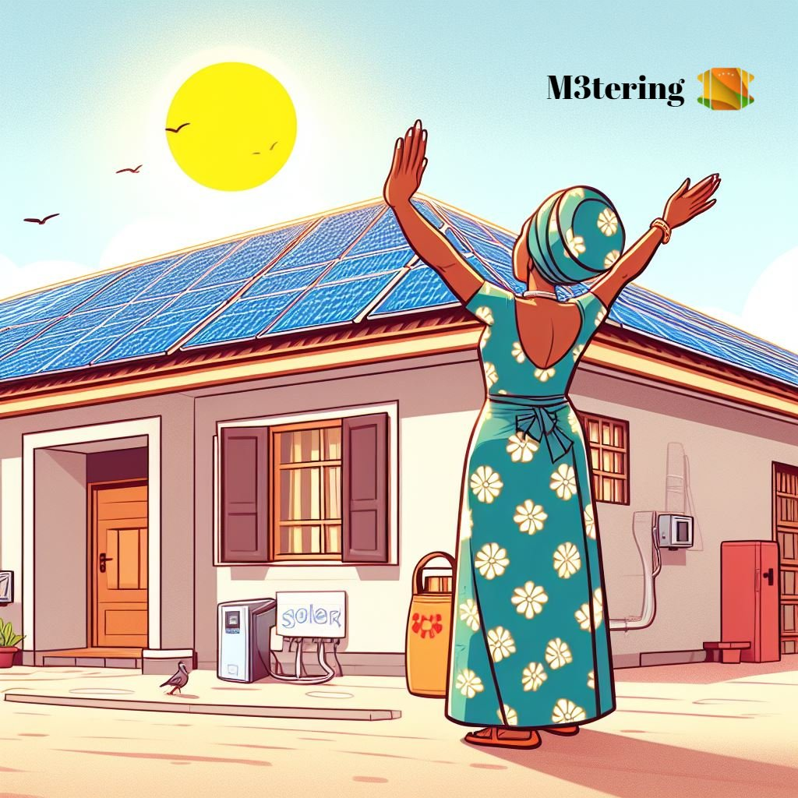

# What is the M3tering protocol

In a nutshell, `M3tering` is a _token incentivized protocol,_ aimed at driving capital investment in distributed energy resources (DERs) such as rooftop solar projects and to bring clean electricity to underserved communities, especially in Latin America and sub-Saharan Africa, by incentivizing individuals and institutions to become electricity providers through rooftop solar power purchase agreements (rooftop solar PPAs).&#x20;

<figure><figcaption>
Image by <a href="https://twitter.com/TrinityMorphy/">TrinityMorphy</a>
</figcaption></figure>


**Not familiar with PPA:** A Power Purchase Agreement (PPA) is a contract between someone who produces electricity, and a someone who that wants to buy that electricity. The producer agrees to sell the electricity they generate at a set price to the buyer for a specific period, like 5 years. It helps the producer earn money while the buyer secures a reliable and environmentally friendly source of electricity. Learn more [here](https://en.wikipedia.org/wiki/Power\_purchase\_agreement).


Consumers pre-pay for clean electricity using xDAI stablecoins. Providers receive rewards in protocol tokens. The protocol fosters the growth of electrification services through a positive feedback loop where increased participation by providers attracts more energy resources and energy users, thus driving capital into DERs and promoting cleaner energy access in the global south.

The protocol's success hinges on its capacity to provide a reliable, clean, and cost-effective source of electricity through distributed energy resources. This will positively impact the lives of millions while promoting community ownership of the energy infrastructure. Ultimately, the M3tering Protocol aims to contribute to social and economic development by providing a reliable supply of electricity to productive users and promoting distributed energy solutions .

## Become a provider

Own your energy and contribute to cleaner communities. Learn how to install rooftop solar and become a power provider on the M3tering platform.


[the-provider-side.md](protocol-mechanics/the-provider-side.md)

