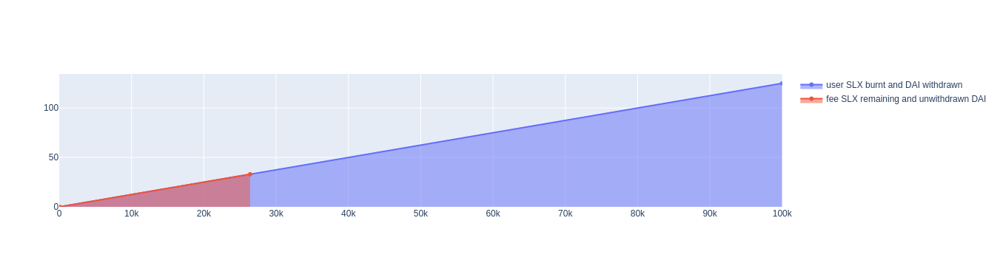

# Burn & Exit fee

## Purpose of the Fee

The application of a 7% fee in the Solaxy contract serves multiple purposes beyond mere revenue generation. It plays a crucial role in discouraging speculators, mitigating front-run attacks, sandwich attacks, and contributes to the overall resilience of the token. Additionally, the fee serves as a valuable resource that can be utilized by the community governance DAO (Decentralized Autonomous Organization) for various purposes such as insurance, public goods funding, or any other initiatives that the community deems appropriate.

#### Disincentive for Speculators

The imposition of a 7% fee acts as a disincentive for speculators looking to exploit short-term price fluctuations. Speculators often engage in rapid buying and selling, seeking to capitalize on market volatility. By incorporating a substantial fee, the smart contract discourages such behavior, as speculators would incur significant costs, making their strategies less profitable.

#### Front-Run Attack Prevention

Front-running attacks involve malicious actors exploiting advanced knowledge of impending transactions. These attackers attempt to execute trades ahead of legitimate users, taking advantage of price changes caused by the upcoming transaction. The 7% fee serves as a deterrent, making front-running attacks economically inviable, as the potential gains would be offset by the imposed fee.

#### Sandwich Attack Mitigation

Sandwich attacks occur when attackers manipulate a transaction by placing their own transactions before and after the target transaction. This manipulation aims to influence the transaction's outcome, typically leading to unfavorable results for the target. The fee mechanism helps mitigate sandwich attacks by increasing the cost and complexity of orchestrating such attacks, making them less attractive to potential attackers.

## Community Governance DAO Utilization

The collected fees are not only a protective measure but also a valuable resource for the community. The DAO can leverage these funds for various community-driven initiatives:

1. **Insurance:** The fees can be used to establish an insurance fund, providing a safety net for users in case of unforeseen events, smart contract vulnerabilities, or other risks.
2. **Public Goods Funding:** The DAO may allocate funds towards supporting public goods that benefit the broader community, such as development grants, security audits, educational programs, or ecosystem enhancements.
3. **Community Initiatives:** Funds can be directed towards projects that align with the community's vision, fostering innovation and sustainability within the ecosystem.
4. **Decentralized Governance:** The collected fees empower the community to actively participate in decentralized governance, enabling stakeholders to vote on proposals, upgrades, and changes to the protocol.

## How it works

A 7% fee is applied when a user redeems SLX. The fee is deducted from the DAI reserve. During redemption, 73.6% of the user's SLX is burnt, and the length of the linear slope of the bonding curve is reduced to 26.4% of the original slope. The area under the burnt section of the slope represents approximately 93% of the total area under the curve (DAI reserve).

### Withdrawal Fee Calculation

The withdrawal function in the smart contract implements a 7% fee. The calculation is executed within the `computeWithdraw` function to save gas and maintain accuracy up to 0.002 DAI.

#### Example Calculation

Assuming:

* User owns 100,000 SLX (100% of supply)
* Slope is 0.00125

<figure><figcaption></figcaption></figure>

1. **Current Price Calculation:**
   * Current Price = User SLX \* Slope = $100,000 \* 0.00125 = $125
2. **Total Area Under Slope:**
   * Total Area = 0.5 \* User SLX \* Current Price = 0.5 \* 100,000 \* $125 = $6,250,000
3. **Price After Burn:**
   * Price After Burn = Remaining SLX \* Slope = $26,400 \* 0.00125 = $33
4. **Remaining Area Under Fee Slope:**
   * Remaining Area = 0.5 \* Remaining SLX \* Price After Burn = 0.5 \* 26,400 \* $33 = $435,600
5. **Fee Percentage:**
   * Fee Percentage = Remaining Area / Total Area = $435,600 / $6,250,000 ≈ 0.069696 or \~7%

## Conclusion

In summary, the 7% fee is not merely a financial transaction cost; it serves as a powerful tool to shape the behavior of participants, safeguard against certain attack vectors, and provide resources for community-driven initiatives. This mechanism maintains the integrity of the bonding curve and effectively manages the DAI reserve.
