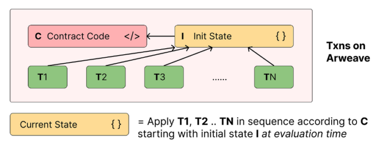

# Mint & Distribution

The DePIN token, which we've named Solaxy (**SLX**) following a successful [naming contest](https://discord.com/channels/1128564139472736296/1135547222956720188)on the community Discord server, can be freely minted by anyone using a token bonding curve mechanism. This mechanism relies on an algorithmic approach embedded within a smart contract, where a reserve of DAI stablecoins backs the creation of SLX tokens. This reserve underpins the tokens' intrinsic value and security.

When users engage in minting SLX tokens, they contribute DAI to the reserve at a rate determined by the curve algorithm. Conversely, when SLX tokens are burned, effectively reducing the token supply, DAI tokens from the reserve would be reclaimed by the burner, at a rate determined by the curve algorithm. Both burning and minting play essential roles in achieving equilibrium between token supply and demand.

_Solaxy_ will feature an uncapped token supply, intricately tied to its demand and price via the linear pricing function where slope; m = `0.0025` and intersect; b = `0`

$$
f(x) = mx + b
$$

<figure><figcaption></figcaption></figure>

This linear bonding curve guarantees equitable incentives for both early and late adopters within the M3tering protocol. The curve's slope remains consistent throughout the contract's lifespan, Notably, this design reduces the typical price volatility associated with exponential curves while simultaneously redistributing some of the early adoption incentives inherent in logarithmic curves.&#x20;

To calculate the amount of DAI tokens required to mint a specific amount of SLX, simply compute the area under the linear function, which interestingly equates to the area of a trapezoid where both `a` and `b` is calculated using `f(x)`; and `h` is the amount of SLX.&#x20;

$$
A = \frac{1}{2}\left ( a+b \right ) h
$$

<figure><figcaption></figcaption></figure>

Combining the two formulae would give us&#x20;

$$
A = \left (h^2+2hx\right)\frac{m}{2}
$$

While the pricing function itself adheres to a linear nature, it's worth noting that the area under the curve, and consequently the required collateral, exhibits exponential growth. This intriguing phenomenon is vividly illustrated in the graph below from actually simulating our function. You can explore this and other phenomenon for yourself using the [bondingplayground](https://bondingplayground.netlify.app/).

<figure><figcaption></figcaption></figure>

### Token Distribution

No token allocations will be earmarked for airdrops nor investors nor teams. This deliberate approach guarantees that the token is naturally disseminated to contributors within the M3tering protocol in proportion to their contributions. But of cause, no tokenomics feels complete without a trusty pie chart, so here's something for your troubles.


i 8 sum pi ... and it was delicious


Once deployed on-chain, the underlying bytecodes for the _Solaxy_ contracts ossifies. It is then immutable and impervious to modifications of any kind. Right now however, the GitHub repository is open to code contributions, bug reports, and feature ideas. You can help us fine-tune and innovate this essential part of our ecosystem.




